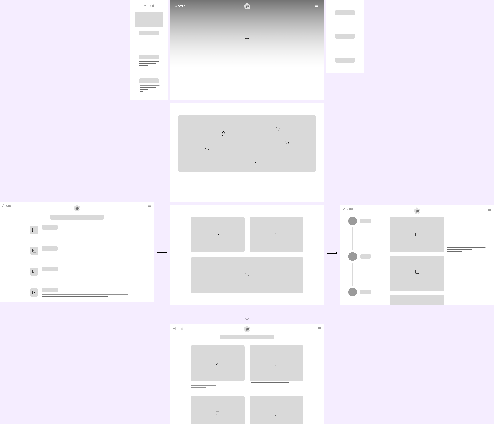

# Development Documentation README

## Table of Contents
1. [Introduction](#introduction)
2. [Aesthetic Choices and Methods](#aesthetic-choices-and-methods)
3. [Usability and Accessibility Considerations](#usability-and-accessibility-considerations)
4. [Specific Implementation Decisions](#specific-implementation-decisions)
5. [Screenshots and Comparisons](#screenshots-and-comparisons)
6. [Iterations and Improvements](#iterations-and-improvements)
7. [Self-Reflection](#self-reflection)
8. [References](#references)

---

### 1. Introduction
This website is designed to inspire and support photographers who wish to capture the unique beauty and historical essence of Camperdown Memorial Rest Park.

---

### 2. Aesthetic Choices and Methods
- **Design Choices**: 
    - Color schemes, theme, typography:
        - Gradient Background:
            - ```background: linear-gradient(#819599, #000000);```
            - ```background: linear-gradient(0deg, #4f318b, #1d4b76, #a97925, #966f89);```
        - The theme aligns with the atmosphere of the park.
        - Typography:
            - ```font-family: 'Courier New', Courier, monospace;```
- **Layout Styles**:
    - [Inspired by Farm League website](https://www.farmleague.us/)

---

### 3. Usability and Accessibility Considerations
- **HCI**:
    - This website is entirely targeted at photographers, with each page designed to understand their specific needs. The layout and navigation are crafted to create a pleasant, inspirational, and intuitive experience. 
    - The website’s usability features make it easy to explore, encouraging photographers to immerse themselves in the beauty of Camperdown Memorial Rest Park and capture it in their work.

- **Accessibility**:
    - Color contrast checked for readability:
        - 
    - Compatible with screen readers:
        - The website is accessible to users who rely on screen readers.

---

### 4. Specific Implementation Decisions
- **Home Page**:
    - Animated arrow guides users to scroll down.
    - Three navigation sections guide users to corresponding pages:
        - Users can access different pages not only from the navigation bar but also through the main section on the homepage.

- **Perfect Moments Page Animated Background**:
    - The background color transitions through ```linear-gradient(0deg, #4f318b, #1d4b76, #a97925, #966f89);```, reflecting the shifts from sunrise to night.

---

### 5. Screenshots and Comparisons
- **Wireframes**:
    - 
- **Prototypes**:
    - 

---

### 6. Iterations and Improvements
- Based on feedback from photographers and relevant users, changes included:
    - Changing the flower icon to a "home" text label for clearer navigation.
    - Adding a fifth page, the "About" page:
        - Initially, the "About" section was designed as an overlay sidebar, but a full page was chosen to accommodate more content on the park’s history and current use.
    - Simplifying the "Perfect Moments" page by removing images:
        - Reduced cognitive load to focus on the best photography times throughout the day.
    - Removing extra text from the gallery page:
        - Allows users to focus more on photographs, minimizing reading time.

---

### 7. Self-Reflection
- Enjoyed capturing all website images personally, adding authenticity to this photographer-focused inspiration site.
- Learned the value of good coding practices:
    - Using relevant class names improved styling consistency.
    - Minifying and unifying code sections enhanced readability.
    - Experimenting with interactive elements added depth and engagement to the user experience.

---

### 8. References
- CSS Bouncing Arrow. (n.d.). CodePen. https://codepen.io/bitstarr/pen/XjaJGz
- CSS Gradient Animator. (n.d.). https://www.gradient-animator.com/
- CSS Animatable Properties - Tutorial Republic. (n.d.). https://www.tutorialrepublic.com/css-reference/css-animatable-properties.php
- Coding2GO. (2023, June 4). How to create a Responsive Navigation Bar (for beginners) [Video]. YouTube. https://www.youtube.com/watch?v=U8smiWQ8Seg
- W3Schools.com. (n.d.). https://www.w3schools.com/
- Wells, T. (2022, January 7). Create a simple responsive image gallery with HTML and CSS. Medium. https://timnwells.medium.com/create-a-simple-responsive-image-gallery-with-html-and-css-fcb973f595ea

---
